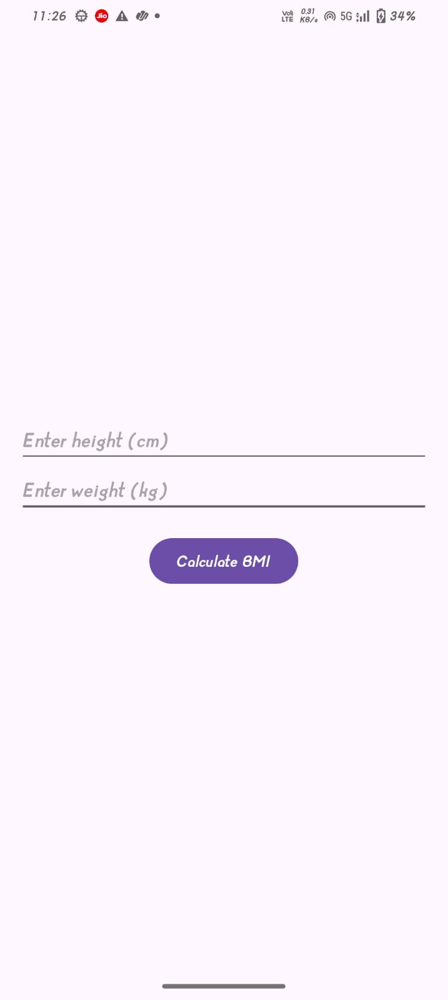
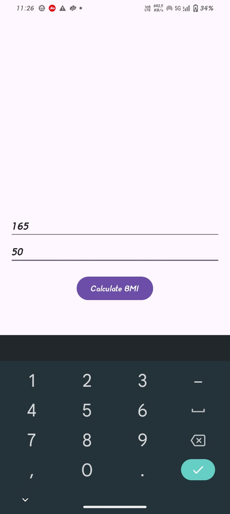

# 📱 BMI Calculator App

A simple BMI (Body Mass Index) Calculator built in Android with Kotlin to practice Fragments and Data Passing.

# This project demonstrates how to:

- Use Fragments (InputFragment, ResultFragment)

- Pass data between fragments using Bundles / FragmentManager

- Handle basic user input and output in an Android app

# 🚀 Features

1.Enter height and weight in the InputFragment

2.Calculate BMI and display results in the ResultFragment

3.Simple UI for better understanding of fragment transactions

4.Clean and minimal codebase for learning

# 🛠️ Tech Stack

Language: Kotlin

UI: XML Layouts

Architecture: Single MainActivity hosting fragments

# Concepts Covered:

Fragment lifecycle

Data passing with Bundle

Fragment transactions (replace())

# 📂 Project Structure

├── MainActivity.kt          # Hosts the fragments

├── InputFragment.kt         # Takes user input (height, weight)

├── ResultFragment.kt        # Displays calculated BMI

└── res/layout/              # XML layouts for activity and fragments

# 📸 Screenshots 

### INPUT FRAGMENT

### INPUT FRAGMENT

### OUTPUT FRAGMENT

	
# 📖 Learning Outcome

## This project helped me understand:

How to switch between fragments

Passing data safely between fragments

Basic fragment lifecycle and transactions

# ⚡ How to Run

Clone this repository  https://github.com/suhaniranka006/BMI_Calculator.git

Open in Android Studio

Run the app on an emulator or physical device

# 🙌 Future Improvements

Add proper input validations

Improve UI with Material Components

Store past BMI records using Room Database
